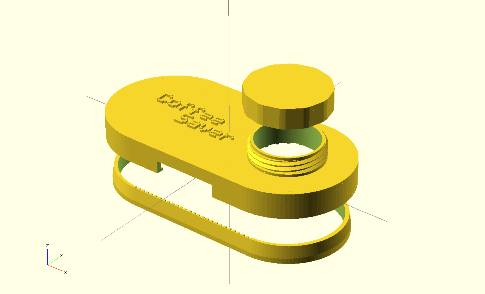

Coffee Saver
============

Coffee Saver is a project to create a reusable and versatile *cap* for an open bag of coffee granules, which can be produced on a 3D Printer.

The main CAD software used for this project is [OpenSCAD](http://www.openscad.org/) with additional functionality provided by [Dan Kirshner's OpenSCAD Threading Library](http://dkprojects.net/openscad-threads/threads.scad), [PGreenland's Text Library](https://www.thingiverse.com/thing:59817/#files), and [DannyStaple's Pyramid Function](https://github.com/dannystaple/OpenSCAD-Parts-Library/blob/master/pyramid.scad). 

Repo Structure
--------------

	/- root
		|- oscad  		   : OpenSCAD files for the various parts
		|   |- version <n> : Files pertaining to a specific version of the design
		|
		|- stl    		   : Compiled STL model files ready to be placed into print jobs
		|   |- version <n> : Files pertaining to a specific version of the design
		|
		|- print  		   : Verfied .x3g Print Files ready to be produced
		|
	    |- images 		   : Photos and Screenshots of Designs and the Build Process

Version 1
---------

Printing
--------

In the Swansea University (UK) Computer Science Department we have a [Makerbot Replicator 2X](http://store.makerbot.com/replicator2x) 3D Printer with Dual Extruders. Testing of the print quality and design should be assumed to be using this hardware unless otherwise stated.

Licensing
---------

The code and model files herein are distributed freely under the *WTFPL – Do What the Fuck You Want to Public License*. More details can be found in the LICENSE file in the root of this repo.